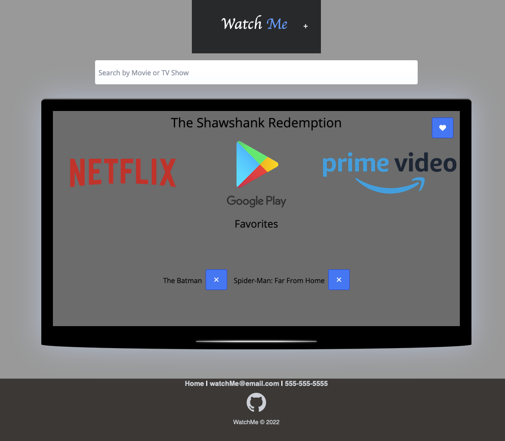

# WatchMe

## Description

A simple application to allow users to search for their favorite Television Show / Movies and find out which streaming services they are currently available on.

## Supported Services

We currently support: 

- HBO Max
- Hulu
- Netflix
- Disney+
- Google Play
- Amazon Prime Video

## Features

- Allows user to search for a desired movie or TV show.
- Display the streaming services the title is currently available on.
- Allow users to save a list of their favorite titles to come back to and check the status of at a later data.

## Usage

Try it out [here](https://mcarson24.github.io/watch_me/).

## License

This project is open-sourced software and is licensed under the terms of the [MIT License](https://opensource.org/licenses/MIT).